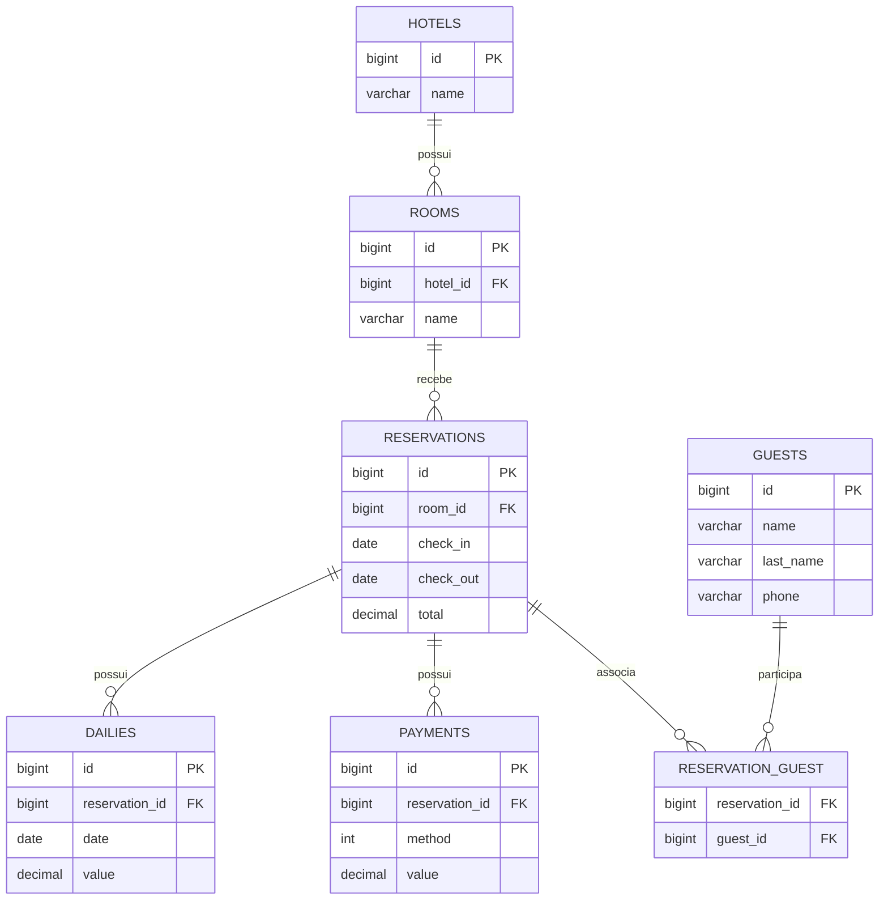

# Modelagem do Banco de Dados

## Diagrama Entidade-Relacionamento

## Relacionamentos

- Um hotel pode possuir vários quartos.
- Um quarto pertence a um único hotel.
- Um quarto pode possuir várias reservas ao longo do tempo.
- Uma reserva pode possuir várias diárias.
- Uma reserva pode possuir vários pagamentos.
- Uma reserva pode possuir vários hóspedes e um hóspede pode participar de várias reservas, caracterizando uma relação N:N por meio da tabela `reservation_guest`.

### Legenda

- **PK**: Primary Key (chave primária)
- **FK**: Foreign Key (chave estrangeira)